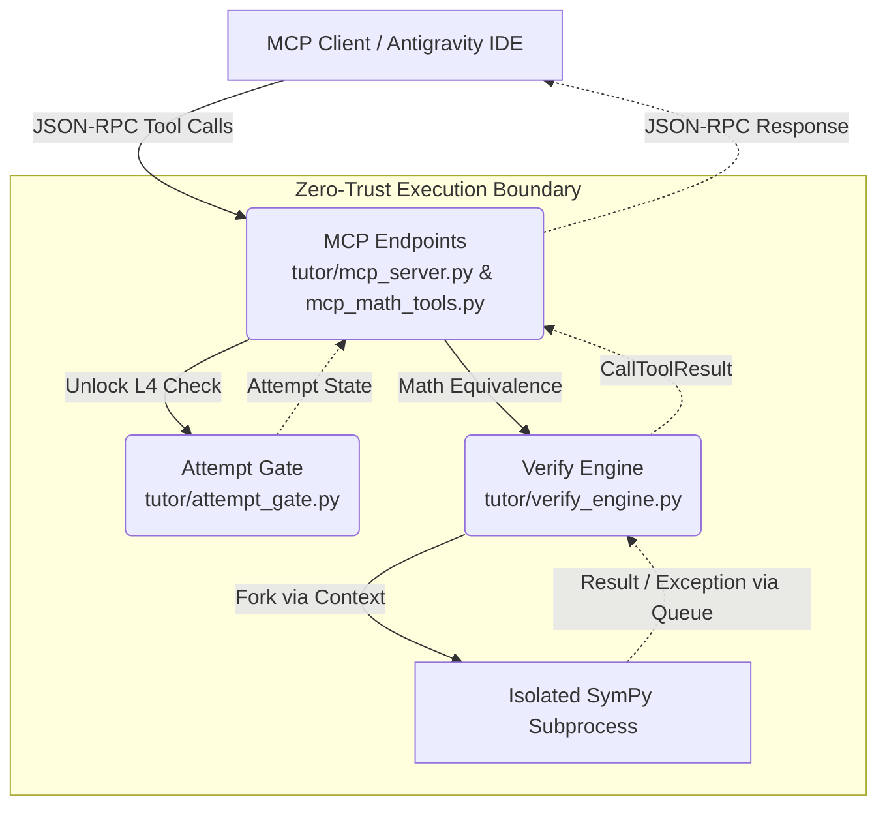

# ADS-Tutor: Zero-Trust Discrete Math Tutoring System

## Project Overview

**ADS-Tutor** is a local-first, verification-driven discrete math tutoring agent built for MAT 320/02 Discrete Structures (SUNY New Paltz, Fall 2026). Guided by the *Applied Discrete Structures* textbook, the tutor enforces a rigorous pedagogical protocol: it is a *tutor*, not a solver. It maximizes student transfer-of-skill by verifying mathematical claims, strictly gatekeeping hints until student attempts are made, and ensuring zero hallucination via SymPy verification engines.

## Architecture

The system operates over the Model Context Protocol (MCP) using a stateless, functional pipeline that sandboxes all mathematical evaluations.



## Zero-Trust Engineering

The codebase is hardened against Arbitrary Code Execution (ACE) and stream corruption:

1. **ACE Protection via `parse_expr` Sandboxing**: 
   SymPy's evaluation engine is restricted. The `_sympy_worker` passes an explicitly empty `__builtins__` dictionary and an allowlist of math functions to `parse_expr`. It strictly rejects any inputs containing dunder methods (`__`), eliminating Python Sandbox Escapes.
2. **JSON-RPC Stream Protection**: 
   MCP operates over `stdio`. A rogue `print()` inside the mathematical evaluation logic would irreversibly corrupt the JSON-RPC stream and crash the IDE. The SymPy worker aggressively routes `sys.stdout` to `/dev/null` upon process spawn.
3. **Process Isolation**: 
   The verification engine does not execute within the main thread. Every math check forks a new independent subprocess (`multiprocessing.get_context("fork")`), ensuring absolute isolation and zero state pollution between evaluations.
4. **Placebo-Tested Timeouts**: 
   A hard-kill timeout (`p.terminate()`) protects the tutor from halting problems, infinite recursive evaluations, or algorithmic complexity attacks. If SymPy hangs, the process is safely reaped to prevent zombie processes.

## MCP Tools Documentation

The server exposes a rich set of endpoints to the agent:

### State & Pedagogy (`tutor/mcp_server.py`)
- **`mcp_create_session`**: Initializes a learning session tied to a specific chapter and section.
- **`mcp_submit_student_attempt`**: Logs a student's partial or full work, which is required to pass the Attempt Gate.
- **`mcp_submit_response`**: Submits the agent's planned response. This endpoint intercepts responses flagged with the `L4` (Walkthrough) hint level if no prior student attempt is recorded.
- **`mcp_get_textbook_definition`**: Retrieves verbatim definitions from the canonical course corpus.
- **`mcp_validate_citation`**: Enforces the citation contract by validating that the tutor is only citing retrieved resources.
- **`mcp_get_brain_dump`**: Exposes the internal session state for diagnostics.
- **`mcp_verify_math_chunk`**: Quick-checks equivalence for inline tutor reasoning.

### Verification (`tutor/mcp_math_tools.py`)
- **`mcp_verify_equivalence`**: Deeply evaluates the mathematical equivalence between `expr1` and `expr2`.
- **`mcp_verify_proof`**: Processes an ordered array of `ProofStep` objects, applying sequential verification to check logical progression step-by-step.

## Execution & Testing

### Running the Server
The server is invoked directly as a Python module, allowing it to hook into the IDE's MCP client:
```bash
python3 -m tutor.mcp_server
```

### Running the Test Suite
The system is backed by the rigorous Context7 `pytest` suite, validating end-to-end (E2E) flows, UX contracts, math evaluation limits, and security boundaries.

```bash
pytest tutor/tests/ -v
```
